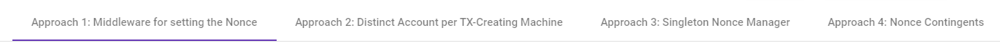
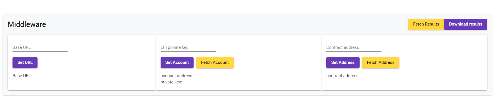
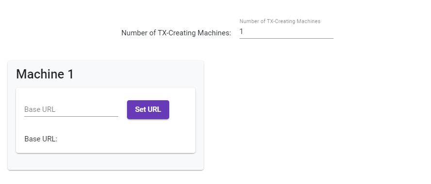
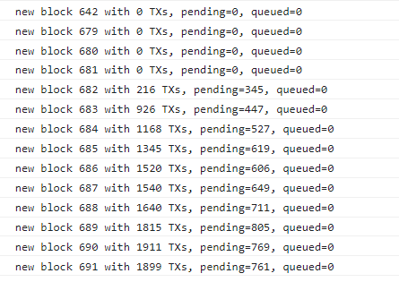
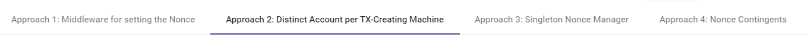
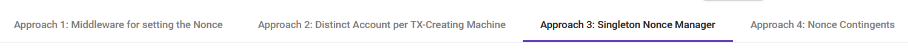
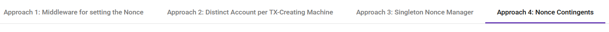

# Bachelor Thesis - Scaling of Transaction-Creating Machines

4 different approaches to realize horizontal scaling of transaction creation

## How to start the application

The following instruction applies to all four approaches. This project only requires that you have installed
Docker and docker-compose (or Docker Desktop for Windows).


### with docker swarm

This guide assumes you have a docker cluster ready to go. See https://docs.docker.com/engine/swarm/swarm-tutorial/
for a tutorial on how to set up a docker cluster.

Add a label to the nodes you want to run the transaction-creating machines on:
```bash
docker node update --label-add txcreation=yes <NODE>
```

Go to the root directory of this project and run:
```bash
docker-compose -f <docker-compose-file> up --build -d
```
Depending on which approach you want to start, replace "<docker-compose-file>" with either
"docker-compose.approach1.yml", "docker-compose.approach2.yml", "docker-compose.approach3.yml", or
"docker-compose.approach4.yml". It can take several minutes until the docker containers are started,
because the base images need to be downloaded and the application has to be build.

After the containers are started, stop the application with:
```bash
docker-compose -f <docker-compose-file> down
```
We only started the containers with docker-compose to build the images.

If your docker cluster has more than one node, you need a registry to distribute the created
images. On your manager node, execute:
```bash
docker service create --name registry --constraint node.role==manager --publish "5000:5000" registry:2
```

Wait for the registry to run. You can check if the registry is ready with:
```bash
curl http://localhost:5000/v2/
```

When the registry is ready, push the created images to the registry with:
```bash
docker-compose -f <docker-compose-file> push
```

Now you can start the application by executing:
```bash
docker stack deploy -c <docker-compose-file> tx-scaling
```

Keep in mind that you can only have a single transaction-creating machine instance per docker node
and a node has to have the label 'txcreation=yes' to be able to host an instance. If
you have additional nodes available, you can scale the number of instances with:
```bash
docker service scale tx-scaling_tx-creation=<NUMBER_OF_INSTANCES>
```

When the docker services are started, wait until the applications inside the containers are running
and ready as well (inspect the docker logs). Then, on the manager node, find out the container id
of the geth node with 'docker ps' and execute on Windows:
```bash
.\unlock-accounts-and-start-miner.bat <container-id>
```
or on Linux (you might have to explicitly mark the file as executable or precede it with "sh"):
```bash
.\unlock-accounts-and-start-miner.sh <container-id>
```
This will not only tell the geth node to start mining, but will also compile and deploy the Smart Contracts.
Wait for the command to finish.


### without docker swarm

If you don't use docker swarm, you can only run a single transaction-creating machine instance.

Go to the root directory of this project and run:
```bash
docker-compose -f <docker-compose-file> up --build -d
```
Depending on which approach you want to start, replace "<docker-compose-file>" with either
"docker-compose.approach1.yml", "docker-compose.approach2.yml", "docker-compose.approach3.yml", or
"docker-compose.approach4.yml". It can take several minutes until the docker containers are started,
because the base images need to be downloaded and the application has to be build.

When the docker containers are started, wait until the applications inside the containers are running
and ready as well (inspect the docker logs). Then, find out the container id of the geth node with 'docker ps'
and execute on Windows:
```bash
.\unlock-accounts-and-start-miner.bat <container-id>
```
or on Linux (you might have to explicitly mark the file as executable or precede it with "sh"):
```bash
.\unlock-accounts-and-start-miner.sh <container-id>
```
This will not only tell the geth node to start mining, but will also compile and deploy the Smart Contracts.
Wait for the command to finish.


## How to use the application

The frontend of this application has only been tested with Firefox and Chrome.

When the application has started, open your browser and visit the frontend at http://localhost:4200 (if the docker container
with the angular-frontend does not run on your local machine, replace "localhost" with the
respective IP-Address/DNS-Name). In the very top, you can see a text box where you can specify
the address of the geth node. It is important that you don't specify the protocal or the port.
The geth node is configured to open port 8545 for HTTP and 8645 for WebSocket, and the frontend
expects this configuration, so you cannot change it. If the geth node is running on your local
machine, just type "localhost" and click the "Connect"-button.


### Approach 1


If you decided to test approach 1 (i.e. you used docker-compose.approach1.yml), then choose Approach 1
in the navigation bar directly under the text box for the geth node address.


In the input box for the base URL, specify the location of the middleware and click "Set URL".
If the middleware is running on your local machine, use "http://localhost:8080" as the location.
After you set the URL, you can additionally configure the address of the Smart Contract or
which Ethereum account should be used. But the default configuration for these values will
work fine if you did not change settings anywhere else.


Below, you can configure the number of transaction-creating machines. This does not actually
add or remove instances of the machines. It only adds or removes the respective "control panels" for
the machines in the UI. Inside the control panels, you can set the base URL for the transaction-creating machines. Find
out the port for the machine(s) with docker ps and specify the location, e.g.
"http://localhost:49153". Afterwards, you can configure some additional paramaters, but again,
the default configuration should work just fine if you didn't change settings anywhere else.

Now, the application is ready to start the test run. Press the "Listen for new Blocks"-button
in the top-right. In the dev-console of your browser, a message is printed every time a new
block is mined, containing the blocknumber, the number of transactions in the block and the
number of currently pending and queued transactions.


Start the transaction-creating machine(s) by pressing the "Start all Machines"-button. It is
important that the frontend is listening for new blocks BEFORE you start the machines.
Otherwise, some data about the transactions might be missing later, such as the time when
they were included in the blockchain, and it will appear as if they failed. Of course, you
can fetch the missing information manually from the geth node later, but it is much more
convenient to let the frontend do this work for you.

To finish the test run, press the "Stop all machines"-button. Wait until the number of included,
pending and queued transactions is 0 in the dev-console logs. Then, press the "Stop Listening
For Blocks"-button.

To download the collected data, press "Fetch Results"-button on the middleware control panel.
Don't press this button more than once, that might corrupt the data. Wait for the
"Successful"-message shows up. Depending on the number of created transactions, this
might take a few seconds, because the data from the middleware and the data from the block
listener have to be combined. Afterwards, you can press the "Download results"-button.
This will download a json-file containing the results. The results will also be logged in
the dev-console, so you can do some simple tests right there, such as comparing the overall
number of transactions with the number of succeeded transactions to find out if some
transactions failed.


### Approach 2


If you decided to test approach 2 (i.e. you used docker-compose.approach2.yml), then choose Approach 2
in the navigation bar directly under the text box for the geth node address.


Below, you can configure the number of transaction-creating machines. This does not actually
add or remove instances of the machines. It only adds or removes the respective "control panels" for
the machines in the UI. Inside the control panels, you can set the base URL for the transaction-creating machines. Find
out the port for the machine(s) with docker ps and specify the location, e.g.
"http://localhost:49153". Afterwards, you can configure some additional paramaters, but again,
the default configuration should work just fine if you didn't change settings anywhere else.
The only thing you have to configure for the machines is the Ethereum account, because
approach 2 requires that every machine uses its own Ethereum account. So if you are testing
the application with more than one machine, look up the private keys of other accounts
that have pre-allocated Ether in accounts.txt file at the root of the project. Copy a private
key, paste it in the input box and press the "Set Account"-button, so that every machine
has its own account.

Now, the application is ready to start the test run. Press the "Listen for new Blocks"-button
in the top-right. In the dev-console of your browser, a message is printed every time a new
block is mined, containing the blocknumber, the number of transactions in the block and the
number of currently pending and queued transactions.


Start the transaction-creating machine(s) by pressing the "Start all Machines"-button. It is
important that the frontend is listening for new blocks BEFORE you start the machines.
Otherwise, some data about the transactions might be missing later, such as the time when
they were included in the blockchain, and it will appear as if they failed. Of course, you
can fetch the missing information manually from the geth node later, but it is much more
convenient to let the frontend do this work for you.

To finish the test run, press the "Stop all machines"-button. Wait until the number of included,
pending and queued transactions is 0 in the dev-console logs. Then, press the "Stop Listening
For Blocks"-button.

To download the collected data, press "Fetch Results"-button on the middleware control panel.
Don't press this button more than once, that might corrupt the data. Wait for the
"Successful"-message shows up. Depending on the number of created transactions, this
might take a few seconds, because the data from the middleware and the data from the block
listener have to be combined. Afterwards, you can press the "Download results"-button.
This will download a json-file containing the results. The results will also be logged in
the dev-console, so you can do some simple tests right there, such as comparing the overall
number of transactions with the number of succeeded transactions to find out if some
transactions failed.


### Approach 3


If you decided to test approach 3 (i.e. you used docker-compose.approach3.yml), then choose Approach 3
in the navigation bar directly under the text box for the geth node address.


Below, you can configure the number of transaction-creating machines. This does not actually
add or remove instances of the machines. It only adds or removes the respective "control panels" for
the machines in the UI. Inside the control panels, you can set the base URL for the transaction-creating machines. Find
out the port for the machine(s) with docker ps and specify the location, e.g.
"http://localhost:49153". Afterwards, you can configure some additional paramaters, but again,
the default configuration should work just fine if you didn't change settings anywhere else.

Inside the control panel of the first machine, press the "Synch nonce"-button. This will
fetch the current nonce from the Ethereum network and store it at the Redis Nonce Manager.

Now, the application is ready to start the test run. Press the "Listen for new Blocks"-button
in the top-right. In the dev-console of your browser, a message is printed every time a new
block is mined, containing the blocknumber, the number of transactions in the block and the
number of currently pending and queued transactions.


Start the transaction-creating machine(s) by pressing the "Start all Machines"-button. It is
important that the frontend is listening for new blocks BEFORE you start the machines.
Otherwise, some data about the transactions might be missing later, such as the time when
they were included in the blockchain, and it will appear as if they failed. Of course, you
can fetch the missing information manually from the geth node later, but it is much more
convenient to let the frontend do this work for you.

To finish the test run, press the "Stop all machines"-button. Wait until the number of included,
pending and queued transactions is 0 in the dev-console logs. Then, press the "Stop Listening
For Blocks"-button.

To download the collected data, press "Fetch Results"-button on the middleware control panel.
Don't press this button more than once, that might corrupt the data. Wait for the
"Successful"-message shows up. Depending on the number of created transactions, this
might take a few seconds, because the data from the middleware and the data from the block
listener have to be combined. Afterwards, you can press the "Download results"-button.
This will download a json-file containing the results. The results will also be logged in
the dev-console, so you can do some simple tests right there, such as comparing the overall
number of transactions with the number of succeeded transactions to find out if some
transactions failed.


### Approach 4


If you decided to test approach 4 (i.e. you used docker-compose.approach4.yml), then choose Approach 4
in the navigation bar directly under the text box for the geth node address.


Below, you can configure the number of transaction-creating machines. This does not actually
add or remove instances of the machines. It only adds or removes the respective "control panels" for
the machines in the UI. Inside the control panels, you can set the base URL for the transaction-creating machines. Find
out the port for the machine(s) with docker ps and specify the location, e.g.
"http://localhost:49153". Afterwards, you can configure some additional paramaters, but again,
the default configuration should work just fine if you didn't change settings anywhere else.

However, you can change the nonce contingent size in the control panels if you don't want
to run the test with the default size of 100. Just make sure that the size is same for
every machine. In theory, different sizes should work as well, but this has not been tested.

Inside the control panel of the first machine, press the "Synch nonce"-button. This will
fetch the current nonce from the Ethereum network and store it at the Redis Nonce Manager.

Now, the application is ready to start the test run. Press the "Listen for new Blocks"-button
in the top-right. In the dev-console of your browser, a message is printed every time a new
block is mined, containing the blocknumber, the number of transactions in the block and the
number of currently pending and queued transactions.


Start the transaction-creating machine(s) by pressing the "Start all Machines"-button. It is
important that the frontend is listening for new blocks BEFORE you start the machines.
Otherwise, some data about the transactions might be missing later, such as the time when
they were included in the blockchain, and it will appear as if they failed. Of course, you
can fetch the missing information manually from the geth node later, but it is much more
convenient to let the frontend do this work for you.

To finish the test run, press the "Stop all machines"-button. Wait until the number of included,
pending and queued transactions is 0 in the dev-console logs. Then, press the "Stop Listening
For Blocks"-button.

To download the collected data, press "Fetch Results"-button on the middleware control panel.
Don't press this button more than once, that might corrupt the data. Wait for the
"Successful"-message shows up. Depending on the number of created transactions, this
might take a few seconds, because the data from the middleware and the data from the block
listener have to be combined. Afterwards, you can press the "Download results"-button.
This will download a json-file containing the results. The results will also be logged in
the dev-console, so you can do some simple tests right there, such as comparing the overall
number of transactions with the number of succeeded transactions to find out if some
transactions failed.


## How to stop the application

To stop the application, just execute:
```bash
docker-compose -f <docker-compose-file> down
```
Replace <docker-compose-file> with the file that you used to start the application. Keep
in mind that all data will be lost after stopping the application. The geth node
will create a fresh Blockchain on the next startup.